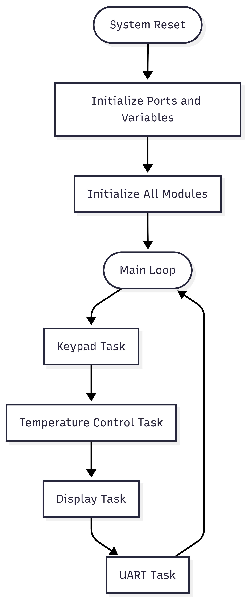
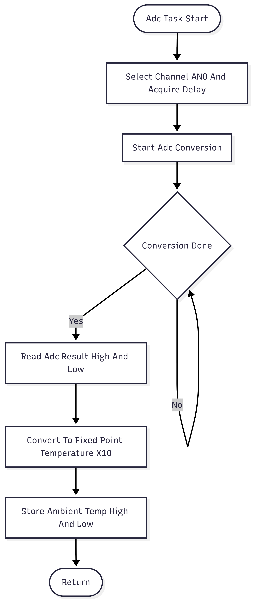
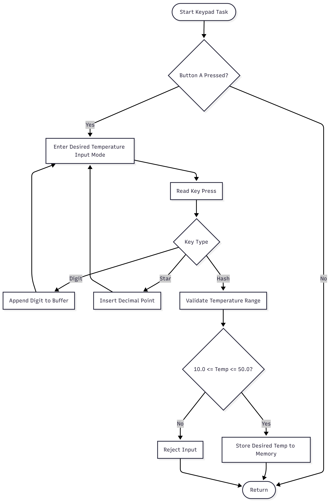
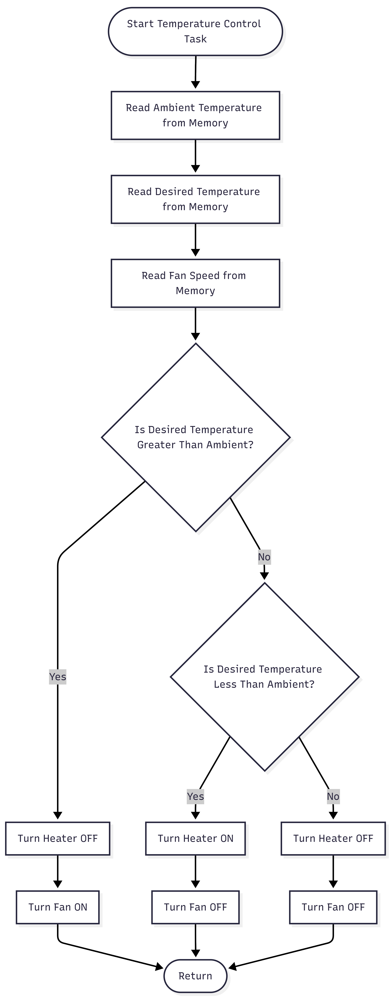
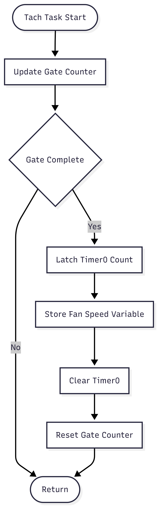
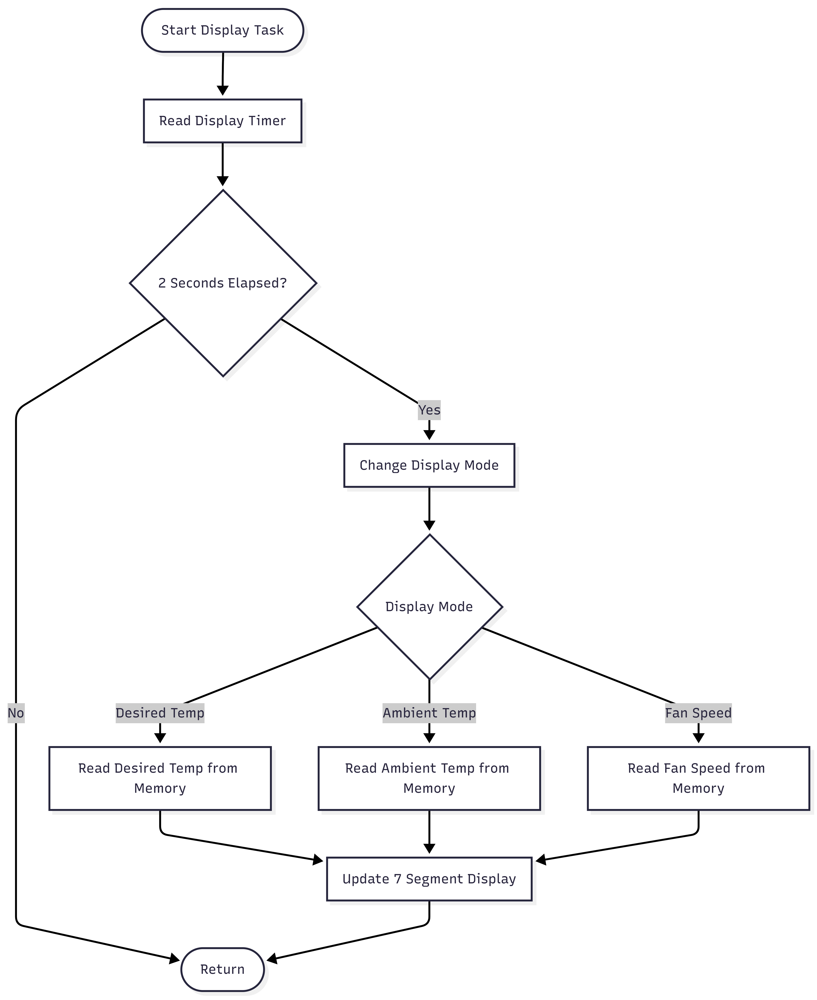
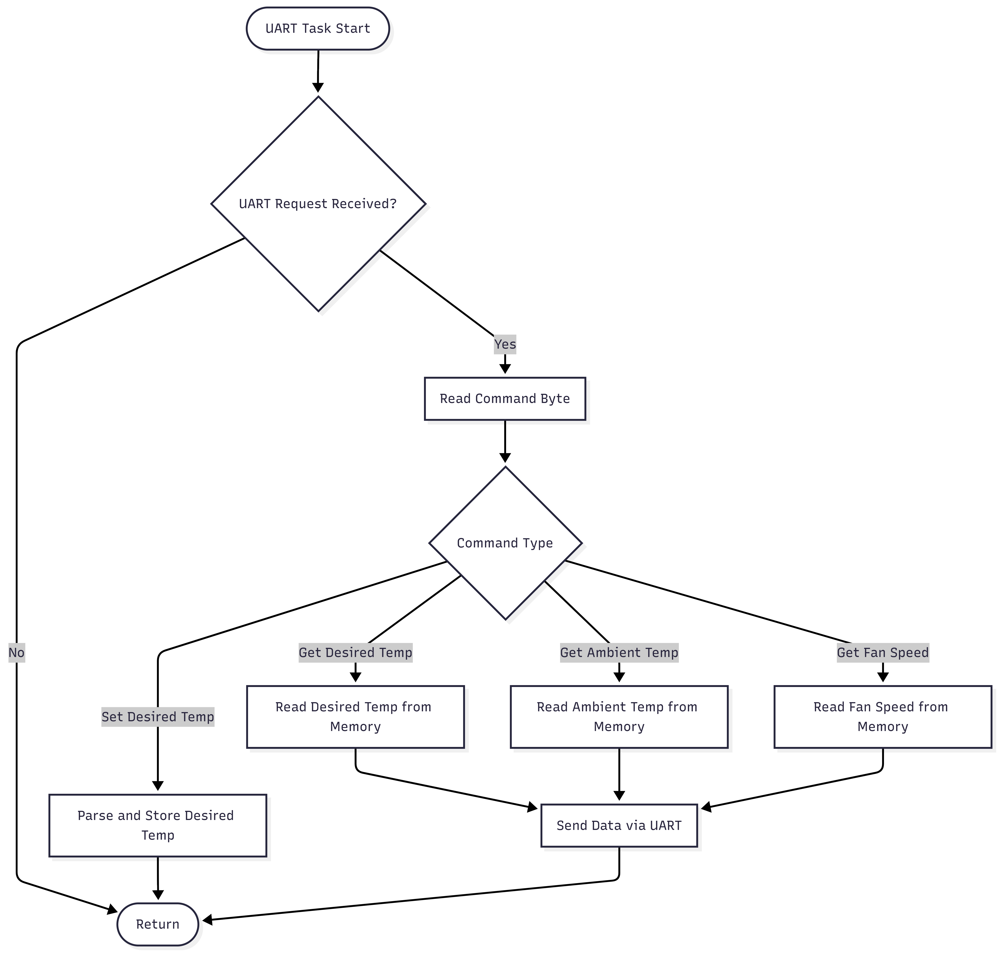

# System Flowcharts – Board #1  
## Home Air Conditioner System

**Author:** Yusuf Tuzcu  
**Student ID:** 151220202144  
**Course:** Introduction to Microcomputers  
**Semester:** Fall 2025

---

## 1. Purpose of This Document

This document presents the complete set of **software flowcharts for Board #1** of the Home Air Conditioner System.  
The flowcharts visually describe the execution logic of the system, illustrating how individual software modules interact within the main program loop.

Each flowchart corresponds to a dedicated software task and is directly mapped to the assembly modules implemented in the project.

---

## 2. Main Program Flowchart

The main program flowchart illustrates the **overall execution structure** of Board #1.  
After power-on reset and system initialization, the controller enters an infinite loop where all functional tasks are executed sequentially.

This flowchart provides a high-level overview of the complete system operation.

### Figure 1. Main Program Flowchart

---

## 3. ADC Flowchart – Ambient Temperature Measurement

This flowchart describes the operation of the **ADC task**, which is responsible for sampling the LM35 temperature sensor connected to analog channel AN0.

The task includes channel selection, acquisition delay, ADC conversion, fixed-point scaling, and storage of the ambient temperature in shared memory.

### Figure 2. ADC Task Flowchart

---

## 4. Keypad Flowchart – Desired Temperature Input

The keypad flowchart illustrates the logic used to scan the 4×4 matrix keypad and process user input.

The task supports numeric entry, decimal point insertion, range validation, and storage of the desired temperature value.

### Figure 3. Keypad Task Flowchart

---

## 5. Temperature Control Logic Flowchart

This flowchart represents the **core decision-making logic** of Board #1.

The desired temperature and ambient temperature values are compared, and the heater and fan outputs are updated accordingly to maintain the target temperature.

### Figure 4. Temperature Control Logic Flowchart

---

## 6. Tachometer Flowchart – Fan Speed Measurement

The tachometer flowchart explains how the fan speed is measured using Timer0 with an external clock input.

Pulse counting is performed within a fixed time window, and the resulting count is interpreted as fan speed in rotations per second (rps).

### Figure 5. Tachometer Task Flowchart

---

## 7. Display Flowchart – Seven-Segment Output

This flowchart describes the display management logic used to refresh the four-digit multiplexed seven-segment display.

The display cycles every two seconds between desired temperature, ambient temperature, and fan speed.

### Figure 6. Display Task Flowchart

---

## 8. UART Flowchart – Serial Communication

The UART flowchart illustrates the serial communication logic used for interaction with a PC terminal and Board #2.

The task handles reception of incoming data, command parsing, and transmission of system status information.

### Figure 7. UART Task Flowchart

---

## 9. Flowchart–Code Relationship

Each flowchart presented in this document directly corresponds to a specific software module:

| Flowchart | Source File |
|---------|-------------|
| Main Program Flowchart | `main.asm` |
| ADC Flowchart | `adc.asm` |
| Keypad Flowchart | `keypad.asm` |
| Temperature Control Flowchart | Control routine in `main.asm` |
| Tachometer Flowchart | `tach.asm` |
| Display Flowchart | `seg7.asm` |
| UART Flowchart | `uart.asm` |

---

## 10. Summary

The collection of flowcharts presented in this document provides a comprehensive visual representation of the runtime behavior and modular structure of Board #1.  
Together, these diagrams complement the source code and enhance the clarity, maintainability, and extensibility of the system design.
